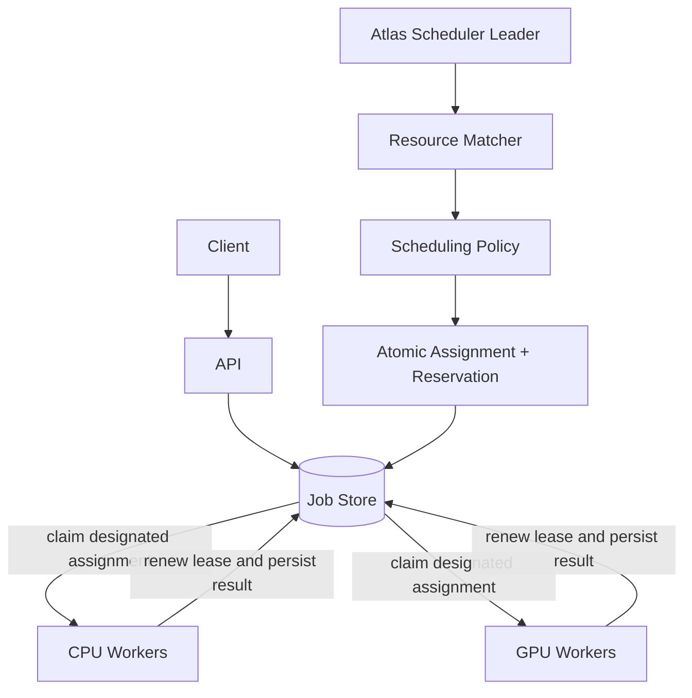

# Atlas

Atlas is a distributed resource-aware job scheduler written in Go for heterogeneous AI workloads. It coordinates CPU/GPU workers using resource-aware scheduling, lease-based execution, crash recovery, retries, and Kubernetes autoscaling.



Atlas separates placement from execution. The scheduler checks CPU, host memory,
GPU count, VRAM, and accelerator fit, then reserves resources transactionally.
Workers execute only their own assignments through a bounded pool. Long work
renews its lease; shutdown drains current work; expired ownership is recovered.

The delivery guarantee is **at-least-once**. A stable execution key lets handlers
deduplicate external effects. Failures retry with capped jitter, and operators
can inspect, retry, or discard dead letters. Persisted trace context connects
submission, scheduling, execution, and result storage in one job trace.

FirstFit, LeastLoaded, BestFit, and PriorityAware strategies make placement
trade-offs testable. CPU and GPU pools can scale independently from queue-depth
signals. GPU workloads and the default GPU deployment are simulated; real GPU
execution requires a suitable handler, image, and device allocation.

## Measured behavior

[Benchmarks](docs/BENCHMARKS.md) report submission throughput, execution throughput,
p95 ready queue wait, database load, and FirstFit/BestFit comparison. Results are
local experiments with retained raw data, not production capacity claims.
[Chaos verification](docs/CHAOS.md) records crash windows, leader failover,
lease loss, timeout, and dependency transport faults with expected outcomes.

The 9,000-job local matrix completed every job. CPU worker scaling with simulated
50 ms handlers produced these median whole-batch results (three 300-job trials):

| Workers | Execution jobs/s | P95 ready wait |
| ---: | ---: | ---: |
| 1 | 25.0 | 10.49 s |
| 8 | 88.6 | 2.06 s |
| 16 | 97.2 | 2.12 s |

Doubling from 8 to 16 workers improved throughput only 9.8%. The benchmark
report investigates polling and database coordination costs, and retains the
raw data, policy comparison, and limitations. Seven process failure scenarios
passed 41 assertions; [acceptance evidence](docs/FINAL-VERIFICATION.md) separates
local runtime checks from Kubernetes manifest validation.

## Run and explore

With Docker Engine running:

```sh
docker compose up --build
```

The API listens on `localhost:8080`. Grafana is on `localhost:3000`; Jaeger is on
`localhost:16686`. See the [API guide](docs/API.md) for authentication and requests,
and [workload examples](docs/WORKLOADS.md) for embedding, inference, and CPU batch
jobs. Kubernetes deployment and optional KEDA prerequisites are in the
[deployment guide](docs/KUBERNETES.md).

For development, use Go 1.26.5. Unit tests run with `go test ./...`; set
`ATLAS_TEST_DATABASE_URL`, `DATABASE_URL`, and `REDIS_ADDR` to disposable services
for database and limiter integration checks. The [test guide](docs/TESTING.md)
describes concurrency and process failure tests, and the
[experiment runbook](docs/EXPERIMENT-RUNBOOK.md) reproduces measurements.

## Design and evidence

- [Architecture](docs/ARCHITECTURE.md): ownership, reservations, policies, and limits.
- [Architecture decisions](docs/adr/0001-postgres-source-of-truth.md): PostgreSQL,
  hybrid scheduling, at-least-once execution, lease versus heartbeat, and etcd trade-offs.
- [Observability](docs/OBSERVABILITY.md): metric meanings, dashboards, and job traces.
- [Trace verification](docs/OBSERVABILITY-VERIFICATION.md): actual exported cross-process evidence.

Atlas began from a Taskflow snapshot and has since changed its resource model,
placement, execution coordination, and operational tooling. Source attribution
and the captured snapshot's license status are recorded in
[PROVENANCE.md](docs/PROVENANCE.md).
