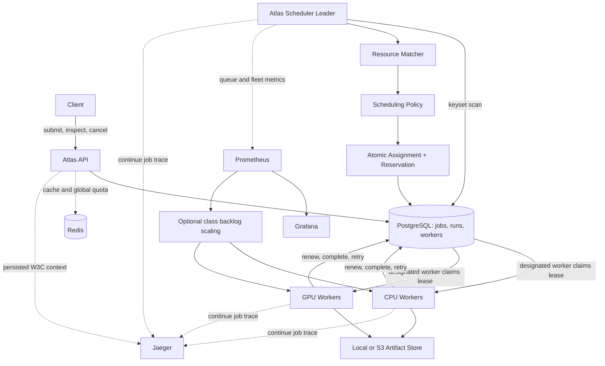
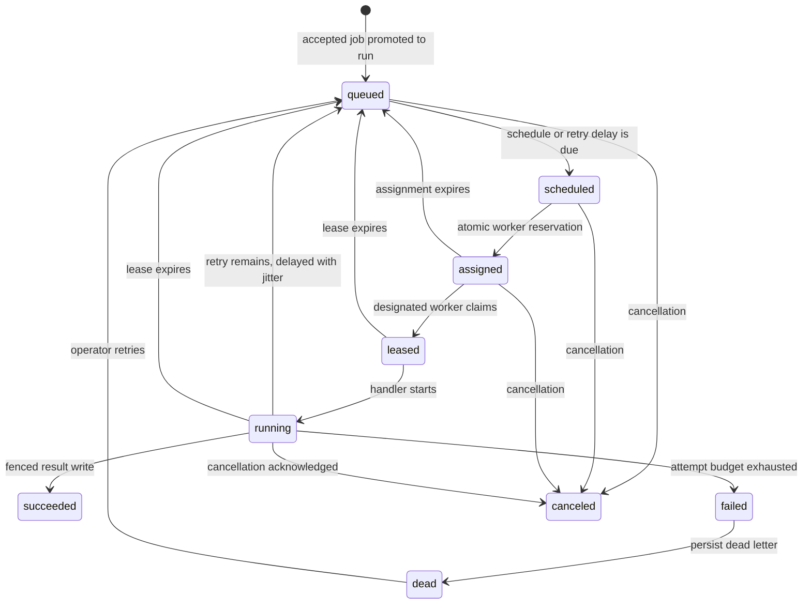

# Atlas architecture

Atlas coordinates heterogeneous CPU and GPU workloads through durable resource assignments, renewable execution leases, and bounded worker concurrency. Its central questions are which worker can safely accept a workload now, and how ownership recovers when that worker stops responding.

## Components and ownership

PostgreSQL owns lifecycle state, assignments, reservations, leases, and retry timing. Redis supports cache-aside reads and a distributed request limiter; neither a cached record nor a local worker counter can authorize execution. Large inputs and outputs live behind artifact URIs, with bounded metadata inline.

The scheduler chooses a worker, then that worker pulls its assignment when an execution slot becomes available. This hybrid design makes placement explicit without requiring inbound worker endpoints. Database transactions provide acknowledgement and recovery. See [ADR 0002](adr/0002-hybrid-scheduling.md).

## Lifecycle and admission

A job definition and a materialized run are different records. One-shot jobs materialize once; recurring definitions can produce successive runs. Backpressure includes accepted one-shot work before promotion. Submission idempotency prevents duplicate definitions, while a stable run `execution_key` supports deduplicating external effects across attempts.

The API validates CPU millicores, host memory MB, GPU count, per-device VRAM MB, accelerator type, priority, queue, tenant, timeout, and attempt budget. A queue is a workload class; its name does not pin a job to a machine. Admission enforces global, per-queue, and per-tenant backlog limits transactionally.

## Placement and reservations

All policies share eligibility checks: requested CPU, host memory, device count, per-device VRAM, and aggregate VRAM must fit unreserved capacity; an optional accelerator must match; and the worker must have a fresh heartbeat and accept new work.

Workers advertise a homogeneous GPU type and memory size. The current model reserves whole GPU devices: a 4 GB request still occupies one device. It does not model MIG, memory sharing within a device, or heterogeneous devices within one worker. GPU examples simulate workload unless a hardware-capable handler and deployment are supplied.

Assignment locks the worker and eligible run, recomputes reservations, and writes `assigned_worker_id` in one transaction. Two scheduler transactions cannot both spend the same free-memory snapshot. Reservations come from assigned and leased/running rows, avoiding an independent counter that could drift after a crash. Assignment expiration bounds unused reservations.

Workers claim only their own unexpired assignments using row locks and `SKIP LOCKED`, and recheck resource fit. A buffered channel limits executing handlers; a local resource guard adds process-level protection. The database remains authoritative across processes. These capacities are scheduling accounting; Kubernetes limits constrain actual container resource use.

## Strategies, fairness, and scans

`SchedulingPolicy.SelectWorker` receives a run candidate, worker inventory, and an explicit time for deterministic scoring.

| Policy | Decision | Trade-off |
| --- | --- | --- |
| FirstFit | First feasible worker in stable ID order | Simple; ordering may strand useful capacity. |
| LeastLoaded | Lowest normalized use of requested resources | Spreads work; may consume specialized workers. |
| BestFit | Least normalized slack after placement | Packs work; may concentrate load. |
| PriorityAware | Priority, waiting age, and GPU slack penalty | Balances urgency and specialization; weights need tuning. |

PriorityAware gives one priority point the weight of one hour of age. Unbounded age allows sufficiently old low-priority work to overtake newer higher-priority work. GPU slack discourages small requests from consuming much larger devices. This is a heuristic, not an optimal-placement or mathematical starvation guarantee. Every chosen assignment is revalidated transactionally.

Promotion and candidate enumeration use keyset pages rather than a fixed first-page cap or growing offsets. Jobs use indexed UUID ordering; runs retain priority/age ordering and a stable tie-breaker. This fixes coverage without making a pass constant time: inspecting backlog and committing assignments still costs work proportional to its size.

## Leadership and datastore failures

A PostgreSQL elector holds a session advisory lock on one dedicated connection. All scheduler replicas share its key. Losing the session releases the lock, allowing a standby to campaign. Release must return or discard the held connection even when the replica never became leader.

Leadership reduces duplicate scheduling effort. It does not replace run uniqueness, resource locking, or lease fencing. Connection loss can make leadership uncertain during a pass, so row-level correctness must remain safe independently. Etcd would add a coordination service and require a leadership-term/fencing design for PostgreSQL writes; a new client library alone would not prevent stale-leader writes. See [ADR 0005](adr/0005-postgres-election-and-etcd.md).

Authoritative writes target the primary database. Read replicas cannot grant ownership. PostgreSQL failure stops assignment and renewal; failed renewal makes a worker stop finalizing uncertain ownership. A Redis quota failure returns an availability error instead of independent local quotas. Cache misses can fall back to PostgreSQL. See [ADR 0001](adr/0001-postgres-source-of-truth.md).

## Leases, cancellation, and shutdown

A lease authorizes one attempt until database expiry. Heartbeat reports worker freshness and capability. A healthy worker can contain a stalled task; a long task requires renewal despite fresh heartbeat. Completion, failure, and renewal check run ID, worker ID, attempt, allowed status, and a live lease. See [ADR 0004](adr/0004-lease-and-heartbeat.md).

On SIGTERM, a worker stops claiming and reports draining. Existing handlers keep heartbeat and renewal during the configured grace period. Cooperative handlers can complete and persist results. After grace expires, renewal stops, execution contexts are canceled, and the process exits without stale finalization. Remaining leases expire and are reclaimed. Kubernetes termination time must exceed the application grace period.

Custom handlers must release their database connections and propagate context
through blocking I/O. The pool can stop waiting for an uncooperative handler,
but a leaked checked-out connection can delay the process's database-pool close;
Kubernetes's final termination deadline remains the outer bound.

Cancellation is durable and propagated to handler contexts. Timeout and retry differ from shutdown. Retry uses a configurable base, multiplier, cap, and random jitter. Exhausted failures enter a dead-letter queue with inspection, retry, and discard APIs. Competing reclaimers change ownership transactionally and count only rows they recovered.

The delivery guarantee is **at-least-once**. A worker can perform an external effect and crash before recording success. Lease fencing cannot undo that effect or stop an uncooperative handler. Handlers need an atomic destination-side idempotency boundary using `execution_key`. See [ADR 0003](adr/0003-at-least-once.md).

## Observability and scaling limits

Persisted W3C context connects HTTP creation, SQL insertion, promotion, assignment, leasing, execution, and result persistence. Attempts have distinct spans. Payloads and baggage are not copied into persisted context. Collector retention is independent of job retention.

Metrics cover ready backlog, attempt outcomes, wait/execution duration, scheduling decisions, worker reservations, retries, dead letters, and reclaim. Global snapshot copies from scheduler replicas use `max`; process event counters use `sum`. Reservation utilization is not hardware utilization. Failed snapshots omit depth and emit health zero, preventing false empty-queue scaling.

Optional KEDA resources scale CPU/GPU pools from class demand. Scaling pods only helps when matching node capacity and database throughput are available. Admission serialization, assignment transactions, connection pools, scanning, polling, and whole-device GPU reservations can limit growth. Actual measurements and limitations belong in [BENCHMARKS.md](BENCHMARKS.md), not an unqualified throughput claim.

Cron and dependencies remain scheduling inputs. The core is resource-aware placement, worker coordination, fault tolerance, concurrency, and observability. Redis caching supports operations rather than defining the scheduling mechanism.

## Verification and source map

Unit tests exercise scoring, matching, retry, admission, and contexts. Database integration tests exercise transactions and migrations. Concurrency tests check competing claims. Process chaos tests kill workers and a leader. Measured experiments retain raw trial data and bounded observation periods; they do not establish exactly-once effects or unlimited scalability.

Read `cmd/api`, `cmd/scheduler`, and `cmd/worker` first, then `internal/scheduler`, `internal/store`, `internal/worker`, `internal/lock`, and `migrations`. See [WORKLOADS.md](WORKLOADS.md), [OBSERVABILITY.md](OBSERVABILITY.md), and [KUBERNETES.md](KUBERNETES.md). Source attribution and baseline history remain in [PROVENANCE.md](PROVENANCE.md) and baseline verification records.
