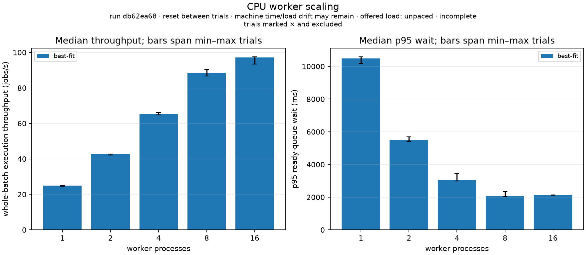
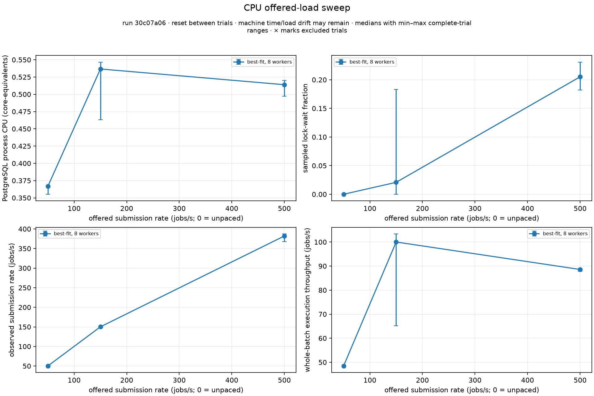
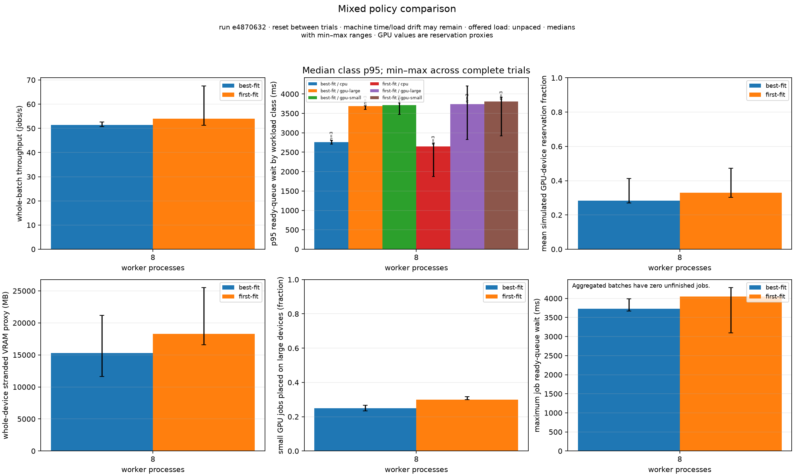

# Measured scheduler behavior

These are local, bounded experiments run on 2026-09-30, not production capacity
claims. The primary matrix submitted **9,000 jobs in 30 complete trials** through
the real HTTP API. Every submission was accepted and every run succeeded at its
first attempt; no trial left unfinished work. An additional 900-job polling
probe tests one possible contributor to the scaling limit.

## Fixture and definitions

The host was WSL2 Linux 6.18.33.2 on an AMD Ryzen 7 H 260, exposing six logical
CPUs and about 15.6 GiB to Linux. Services used Go 1.26.5, PostgreSQL 18.6, and
Redis 8.0.5. This is shared local hardware, not an isolated benchmark machine.
Executable SHA-256 hashes, configuration, seeds, timestamps, and job records
are retained in each report. Runtime code came from the worker/scheduler
features at `189e503`; the controlled experiment harness is `cced2c4`.

Each batch contains 300 jobs. Three repetitions use seeds 608, 609, and 610.
Handlers wait for a simulated 50 ms service time; they do not consume measured
CPU work or execute a model on a GPU. All jobs reserve 1,000 CPU millicores and
128 MB host memory. Workers advertise 4,000 millicores, 8,192 MB, and four
execution slots. Scheduler polling is 100 ms, worker polling 50 ms, leases 3 s,
sampling 250 ms, and HTTP submission concurrency 16. Each service database
pool is capped at four connections. Quotas permit the fixture's burst.

Every trial starts with zero active work and empty task history in its verified,
runner-owned schema. Worker rows remain registered across trials. Configurations
and policies run in a fixed order, so host load and time-order drift can still
affect results. Three repetitions are a small sample. Tables show medians;
figure error bars span observed minimum/maximum, **not confidence intervals**.

| Measurement | Definition |
| --- | --- |
| Submission throughput | Accepted HTTP submissions / submission-phase wall time. Offered pacing can exceed the actual rate. |
| Execution throughput | Succeeded runs / whole batch wall time from first submission through terminal completion. Includes scheduling and drain; not a steady-state completion rate. |
| Scheduling latency | Database acceptance (`jobs.created_at`) to `assigned_at`. |
| Ready queue wait | `scheduled_at` to `started_at`. Submission-to-start is separately retained. |
| PostgreSQL CPU | `/proc` tick deltas over postmaster and descendants, expressed in CPU-core equivalents. Exited processes between samples can be undercounted. |
| Lock wait fraction | Sampled application connections waiting on a PostgreSQL lock / sampled active application connections. This is not a query-level contention total. |
| GPU utilization proxy | Fraction of simulated devices reserved. VRAM reservation and whole-device stranded memory are separate proxies; none measures physical GPU use. |

P95 uses the nearest-rank percentile of observed job timings. The retained p95
fields were independently recomputed from job-level timestamps. All primary
database samples succeeded; CPU's initial warm-up sample is explicitly marked.

## Worker scaling: CPU-only axis

BestFit receives CPU-only workers, removing changing GPU topology from this
axis. Unpaced submissions produce an actual rate of roughly 383–423 jobs/s.

| Workers | Submit jobs/s | Execute jobs/s | P95 assignment latency ms | P95 ready wait ms | Mean DB CPU cores | Sampled lock-wait fraction |
| ---: | ---: | ---: | ---: | ---: | ---: | ---: |
| 1 | 415.6 | 25.0 | 10,894 | 10,492 | 0.117 | 0.053 |
| 2 | 423.4 | 42.7 | 6,008 | 5,506 | 0.192 | 0.088 |
| 4 | 414.6 | 65.2 | 3,751 | 3,028 | 0.311 | 0.117 |
| 8 | 394.2 | 88.6 | 2,656 | 2,064 | 0.520 | 0.179 |
| 16 | 382.8 | 97.2 | 2,549 | 2,122 | 0.810 | 0.173 |

Doubling workers from 8 to 16 increased throughput by only **9.8%**, while mean
database CPU rose about **56%** and p95 queue wait did not improve. Sampled
application connections peaked at 38 and 70 respectively. PostgreSQL's server
limit was 100; these observations do not establish connection exhaustion or
full-machine CPU saturation. More workers increase polling and coordination
work without a proportional completion gain.

## Offered load: eight CPU workers

| Offered jobs/s | Actual submit jobs/s | Execute jobs/s | P95 assignment ms | P95 ready wait ms | Mean DB CPU cores | Sampled lock-wait fraction |
| ---: | ---: | ---: | ---: | ---: | ---: | ---: |
| 50 | 50.1 | 48.5 | 162 | 150 | 0.367 | 0.000 |
| 150 | 150.1 | 100.0 | 1,047 | 822 | 0.537 | 0.021 |
| 500 | 382.0 | 88.6 | 2,616 | 2,266 | 0.514 | 0.205 |

The 500 jobs/s target was not attained: actual admission was about 382 jobs/s.
Increasing the target from 150 to 500 increased wait and sampled lock contention,
with lower median whole-batch execution throughput. The 150 jobs/s execution
trials have a wide range, visible in the figure; the median is not evidence of
a universal optimum at that offered rate.

## Bottleneck investigation

The code explains plausible sources of these observations. Admission takes a
global transaction advisory lock and reads backlog to preserve quota invariants.
Promotion and assignment perform per-job/per-run database work. Assignment
locks worker/run rows and recomputes reservations. Worker claims, heartbeat,
janitor, and lease renewal add coordination traffic. Keyset pagination fixes
coverage and large offsets; it does not eliminate these round trips.

A controlled follow-up kept eight CPU workers and the same reset/three-trial
fixture, changing only scheduler polling from 100 to 20 ms. Median throughput
rose from **88.6 to 101.1 jobs/s** and p95 ready wait fell from **2,064 to
1,841 ms**. Mean DB CPU rose from 0.520 to 0.557 core equivalents, while sampled
lock-wait fraction rose from 0.179 to 0.257. This supports polling cadence as a
contributor and shows its coordination cost. It does not isolate every cause,
and sequential runs can still experience different host load.

Before raising worker replicas further, inspect per-query timing and pool wait,
optimize backlog accounting/index access, and evaluate batched promotion or
assignment. Changing the admission lock requires preserving the global quota
invariant. The current data cannot assign an exact percentage of the bottleneck
to locks, logging, round trips, or scheduling work; no such percentage is claimed.

## Policy comparison: 70/20/10 mixed workload

Each 300-job batch contains 210 CPU, 60 small-GPU (one device, 4,096 MB VRAM), and
30 large-GPU (one device, 16,384 MB) jobs. Eight workers comprise four CPU-only,
two 32,768 MB GPU, and two 8,192 MB GPU workers. IDs sort CPU first, large GPU
next, and small GPU last. Jobs are shuffled with the same three seeds for both
policies; concurrent HTTP arrival order can differ. FirstFit runs before BestFit.

| Policy | Execute jobs/s | P95 ready wait ms | Mean reserved device fraction | Stranded VRAM MB | Small jobs on large devices | Maximum ready wait ms |
| --- | ---: | ---: | ---: | ---: | ---: | ---: |
| FirstFit | 54.0 | 3,544 | 0.330 | 18,261 | 18/60 | 4,051 |
| BestFit | 51.5 | 3,498 | 0.283 | 15,315 | 15/60 | 3,733 |

BestFit placed fewer small jobs on large devices and had lower median stranded
VRAM in this topology. It did **not** improve median throughput. FirstFit's trial
range is wide, and the ranges overlap; these three trials do not establish a
statistically reliable throughput winner. Lower reservation utilization is not
necessarily better or worse: it depends on completed useful work and workload
requirements. Raw class-level waits and maximum waits are retained. All classes
completed with zero unfinished jobs in the observation window; this bounded
fixture cannot prove absence of starvation under continuous competing demand.

Each GPU request reserves a whole device. Stranded VRAM is requested-memory
slack on reserved devices, not memory that another job can currently use. Free
small devices below 16 GB are separately recorded as subthreshold available
slack. Neither proxy represents GPU compute occupancy or MIG fragmentation.

## Raw data, diagnostic runs, and reproduction

- [Scaling trials](benchmarks/2026-09-30/scaling/trials.csv), [samples](benchmarks/2026-09-30/scaling/samples.csv), [job-level report](benchmarks/2026-09-30/scaling/report.json.gz).
- [Load trials](benchmarks/2026-09-30/load/trials.csv), [samples](benchmarks/2026-09-30/load/samples.csv), [job-level report](benchmarks/2026-09-30/load/report.json.gz).
- [Mixed trials](benchmarks/2026-09-30/mixed/trials.csv), [samples](benchmarks/2026-09-30/mixed/samples.csv), [job-level report](benchmarks/2026-09-30/mixed/report.json.gz).
- [Polling probe](benchmarks/2026-09-30/poll-probe/report.json.gz).
- [Plot summaries and source hashes](benchmarks/2026-09-30/plots/summary.json).

An earlier diagnostic retained completed task history between batches. It showed
about 72.2 jobs/s with eight workers and 71.4 with sixteen, alongside falling
submission rate as history grew. That confounds worker count and retained data,
so it is **not the primary scaling result**. The original
[scaling report](benchmarks/2026-09-30/diagnostic-history-scaling/report.json.gz)
and [mixed report](benchmarks/2026-09-30/diagnostic-history-mixed/report.json.gz)
are retained. Resetting history changed the curve; elapsed host time also
changed, so the entire difference cannot be attributed to history alone.

Use the [experiment runbook](EXPERIMENT-RUNBOOK.md). The primary commands use
`--jobs 300 --trials 3 --job-duration 50ms` with CPU counts `1,2,4,8,16`, BestFit,
unpaced submission; mixed count `8`, both policies, unpaced; and CPU count `8`,
BestFit, offered rates `50,150,500`. The probe adds `--poll-interval 20ms` to the
eight-worker CPU fixture. Use Linux/WSL and disposable PostgreSQL/Redis services.
The checked-in JSON is gzip-compressed; the plotter accepts it directly.

This measurement does not cover long-duration saturation, heterogeneous real
GPU execution, database failover/restart, live Kubernetes/KEDA scaling, or
physical CPU/GPU utilization of handlers. Those require additional experiments.
